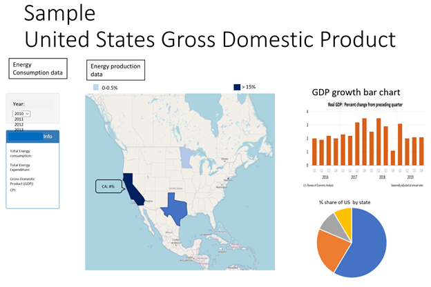
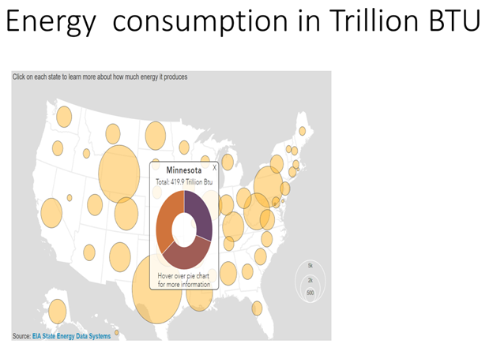
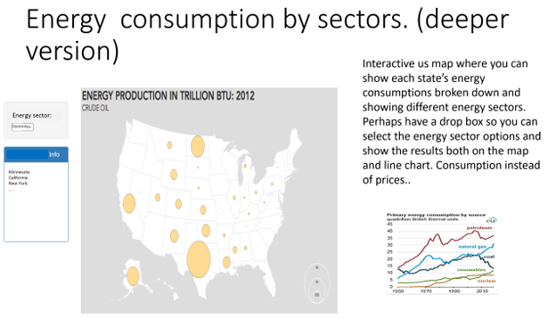

# us-energy-data
## Proposal

- Group Number 4
- Group Members: Akhil Bandi, Eric Button, Adrian Wood, Sung Ahn
- Topic: Visualization of average state’s contribution to U.S. GDP and Energy consumption
- Data Source: https://www.kaggle.com/datasets/lislejoem/us_energy_census_gdp_10-14?resource=download 
- Size of Dataset: 75.53 KB
- Objective/Overview: The purpose of this project is to build an interactive web application by deploying visualization tools with front-end programs including HTML, CSS, and Bootstrap hosted in Github with an index page powered by JavaScript where database and flask server is built and developed behind the scenes. 
## Brief Overview of our plan to approach the project:
1.	Source and identify the dataset
2.	Create a jupyter notebook
3.	Save dataset as CSV file.
4.	Using Pandas, load CSVs into a dataframe, clean and transform the raw data
5.	Load and store the data into a SQL database.
6.	Create tables in the schema.
7.	Create website.
8.	Create flask server.
    - Create index route
    - Create data route
    - Create connection to database
    - Style.js
- Dashboard/landing page showing the overview of the project and menu buttons in a navigation bar. 
    - A heat map of USA heat sensitivity relative to GDP size/share.
    - Have the message box popup with GDP info. when you click on the shaded region of the map dedicated for each state. 
    - Dropdown with year options (2010-2014) and info. When you click 2010, heat map of 2010 GDP will show.
    - Vertical bar chart and pie chart corresponding to each state.
    - Vertical bar shows the y-axis numbers when you have the mouse pointer on the chart.
    - Energy consumption map. 
    - Add bubbles size relative to the energy consumption size in a map size relative to the energy consumption size in a map.
    - Show energy sector breakdowns of the Energy production in a pie chart when you select the state.
    - Interactive U.S. map where you can show each state’s energy consumptions broken down and showing different energy sectors. Perhaps have a drop box so you can select the energy sector options and show the results both on the map and line chart.

# Sample US GDP Page

# Sample Energy Consumption in Trillion BTU

# Sample Energy Consumption By Sector

